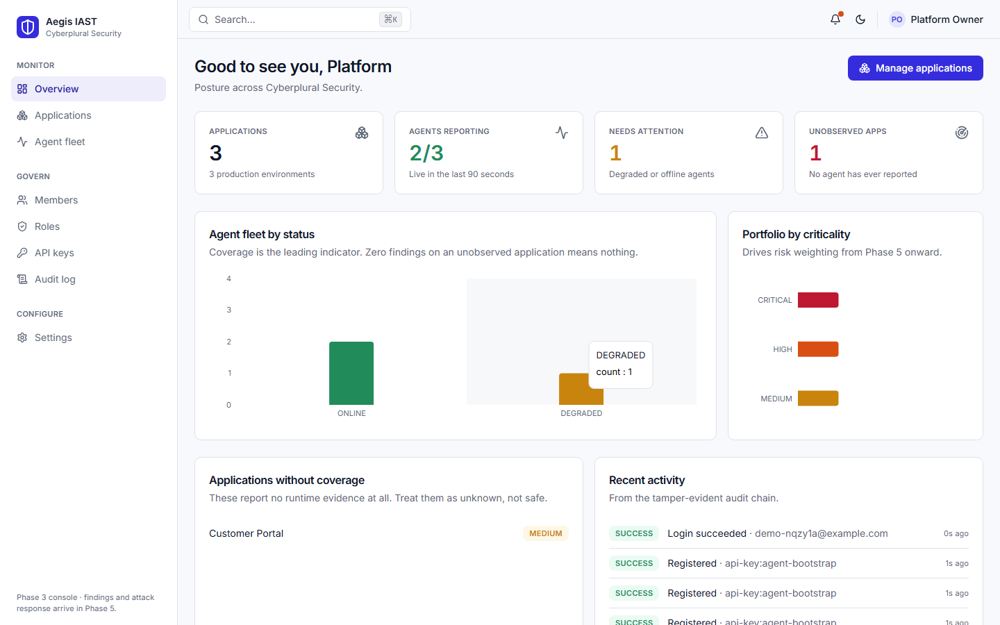
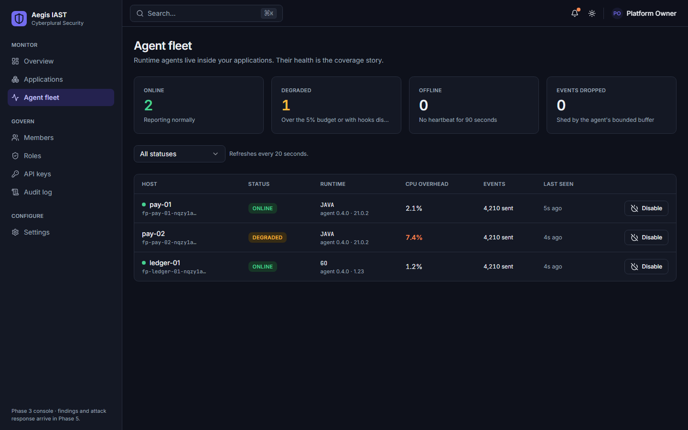

# Aegis IAST

**Interactive Application Security Testing platform** — runtime instrumentation agents, taint-tracking
vulnerability detection, attack detection & response, AI-assisted root cause and remediation, and an
enterprise SOC/developer/executive console.

> `Aegis` is the internal codename. Rename the product string in `packages/shared` and
> `apps/api/src/aegis_api/config.py` if you want a different brand.

---

## What it is

IAST sits inside the running application. A language-native agent instruments the process, watches data
flow from untrusted **sources** (HTTP parameters, headers, message queues) through **propagators**
(string ops, serialization, ORM binding) into security-sensitive **sinks** (SQL, OS command, file path,
LDAP, XPath, deserializer, template renderer, HTTP client). When tainted data reaches a sink without a
matching sanitizer, the agent emits a finding with the exact request, the exact stack frames, and the
exact bytes — no crawler, no fuzzing, no false-positive triage burden.

The same instrumentation doubles as runtime protection (ADR — Application Detection & Response): the
agent sees the attack payload *and* whether it actually reached a sink, so exploitation can be
distinguished from probing.

| | SAST | DAST | **IAST (this)** |
|---|---|---|---|
| Sees source code | yes | no | yes (loaded bytecode/AST) |
| Sees runtime values | no | partial | yes |
| False positive rate | high | medium | very low |
| Needs test traffic | no | yes | yes (CI tests, QA, or prod) |
| Confirms exploitability | no | yes | yes |

## Repository layout

```
apps/
  api/          FastAPI control plane — auth, RBAC, inventory, findings, policy    [Phase 2 ✅]
  gateway/      High-throughput agent ingest — auth, quota, fan-out to Kafka       [Phase 4 ✅]
  worker/       (not yet created — see the note below)                             [Phase 6]
  dashboard/    Next.js 15 console — inventory, fleet, RBAC, audit                 [Phase 3 ✅]

The findings pipeline lives in `apps/api` as `aegis_api.application.findings`, driven by
`aegis-api process-events`, rather than in `apps/worker`. It needs the same domain entities,
repositories, unit of work and RLS binding as the control plane, and duplicating those across
a process boundary would cost more than it buys while there is one consumer. Running it as a
separate process is a deployment choice the CLI already allows. `apps/worker` gets created
when there is a second consumer — the AI pipelines in Phase 6 — and Celery with it.

agents/runtime/
  java-agent/   JVM agent — bytecode instrumentation (Byte Buddy)                  [Phase 4 🚧]
  dotnet-agent/ CLR profiler + Harmony patching                                    [Phase 6]
  node-agent/   Module hooking + async_hooks context propagation                   [Phase 6]
  python-agent/ sys.monitoring + import hooks                                      [Phase 6]
  go-agent/     Compile-time source instrumentation                                [Phase 7]
packages/
  shared/       Cross-language contracts, enums, severity/CWE catalogs
  ui/           Design-system components for the dashboard
  security/     Shared crypto, signing, sanitizer rule sets
  telemetry/    OpenTelemetry conventions
  database/     Migration-adjacent shared SQL, ClickHouse DDL
  proto/        Protobuf/gRPC agent wire contracts
  sdk/          Public API clients (TS + Python)
docs/           Architecture, threat model, ERD, API spec, ADRs, roadmap
docker/         Dockerfiles + local compose stack
helm/           Kubernetes chart
terraform/      Cloud infrastructure
tests/          Cross-service integration and end-to-end suites
```

## Documentation

| Doc | Contents |
|---|---|
| [Product overview](docs/00-product-overview.md) | Problem, personas, capability map, competitive frame |
| [Architecture](docs/01-architecture.md) | C4 views, hexagonal layering, sequence + class diagrams |
| [Threat model](docs/02-threat-model.md) | STRIDE per trust boundary, agent supply-chain risk |
| [Data model](docs/03-data-model.md) | ERD, tenancy strategy, ClickHouse event schema |
| [API specification](docs/04-api-specification.md) | REST surface, error envelope, pagination, auth |
| [Runtime agent design](docs/05-runtime-agent-design.md) | Source/propagator/sink model, wire protocol |
| [AI architecture](docs/06-ai-architecture.md) | LangGraph agent topology, RAG, guardrails |
| [Roadmap](docs/07-roadmap.md) | Phase gates and exit criteria |
| [ADRs](docs/adr/) | Architecture decision records |

## Quick start (Phase 2 control plane)

Prerequisites: Python 3.11+ and PostgreSQL 14+ (either your own instance or the Docker stack below).

```bash
make setup
```

Bring up the backing services (Postgres, Redis, Kafka, ClickHouse, MinIO, OpenSearch, Jaeger):

```bash
docker compose -f docker/docker-compose.yml up -d
```

Copy the environment template and point `AEGIS_DATABASE_URL` at your database:

```bash
cp apps/api/.env.example apps/api/.env
```

Apply migrations, then create the least-privilege application role:

```bash
make migrate
```

```bash
psql -v role_password="'a-strong-password'" -f scripts/postgres/app-role.sql aegis
```

> **Do not run the API as a database superuser.** Superusers bypass PostgreSQL row-level security
> even on tables with `FORCE ROW LEVEL SECURITY`, which silently removes one of the two tenant
> isolation controls. The API logs a warning about this in development and refuses to start in
> staging or production. Point `AEGIS_DATABASE_URL` at the `aegis_app` role created above; migrations
> continue to run as the owner.

Seed the first organization and Owner — the generated password is printed once:

```bash
make seed
```

Start the API:

```bash
make run
```

OpenAPI docs are then at `http://localhost:8080/docs`, liveness at `/healthz`, readiness at `/readyz`,
Prometheus metrics at `/metrics`.

Run the test suite (unit, integration and security; gate is 90% coverage):

```bash
make test
```

Run every quality gate — lint, types, layer boundaries, tests:

```bash
make check
```

### Running the console

```bash
npm install
```

```bash
cp apps/dashboard/.env.local.example apps/dashboard/.env.local
```

```bash
npm run dev
```

The console is at `http://localhost:3100` — **not** 3000, which is taken by another local app. It
calls the API directly, so `AEGIS_CORS_ORIGINS` must include that origin.

| Check | Command |
|---|---|
| Types, lint, unit tests | `npm run check` |
| End-to-end against a live API | `npm run test:e2e --workspace @aegis/dashboard` |





### Operator commands

```bash
cd apps/api && .venv/Scripts/python.exe -m aegis_api.cli --help
```

| Command | Purpose |
|---|---|
| `seed` | Create the first organization and Owner |
| `verify-audit <slug>` | Walk a tenant's audit hash chain and report the first break |
| `sweep-agents <slug>` | Mark agents offline when their heartbeats stop |
| `purge-sessions` | Delete sessions that expired more than a day ago |
| `routes` | Print every registered route — useful when auditing authorization coverage |

## Engineering standards

- Hexagonal architecture: `domain` (pure) → `application` (use cases) → `infrastructure`/`interfaces`
  (adapters). Dependencies point inward only; the domain imports nothing from FastAPI or SQLAlchemy.
- Ruff + Black + mypy (strict) on Python; ESLint + Prettier + `tsc --noEmit` on TypeScript.
- Test coverage gate at 90% for `apps/api`.
- Every architectural decision gets an ADR. Every user-visible change gets a CHANGELOG entry.
- Conventional Commits.

See [CONTRIBUTING.md](CONTRIBUTING.md).

## License

Proprietary. All rights reserved.
