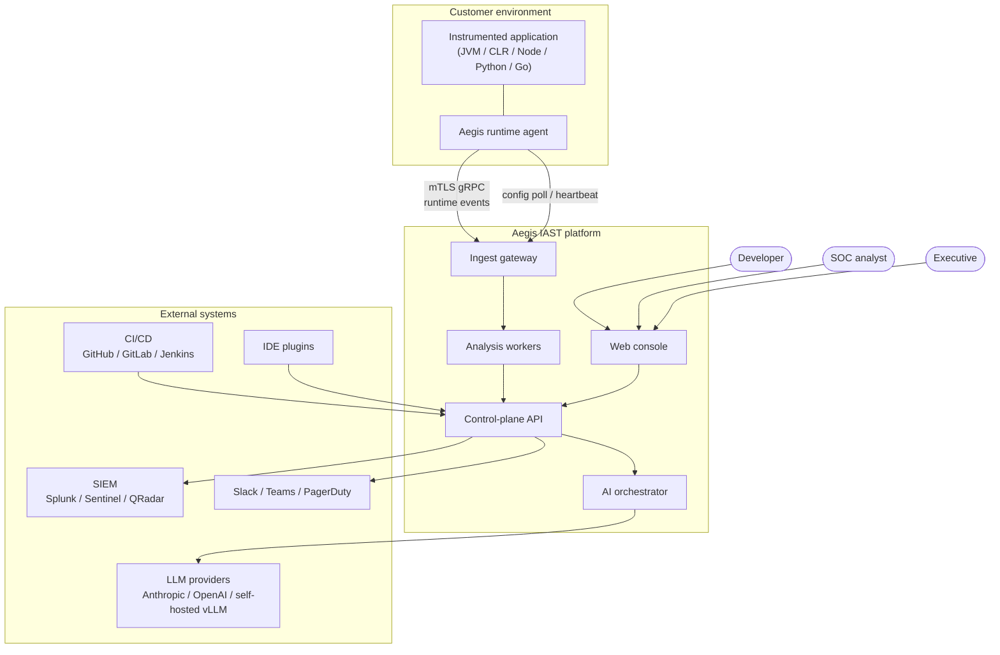
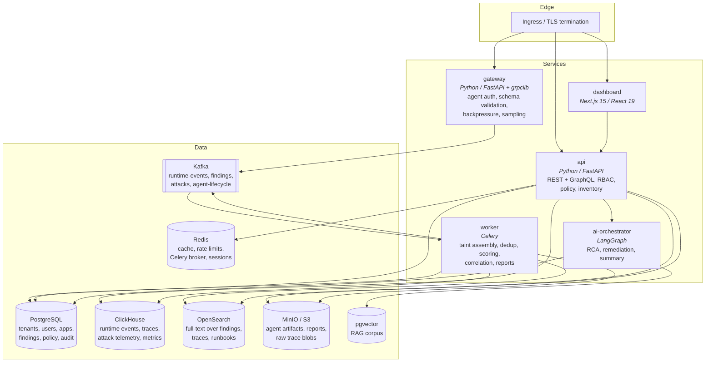
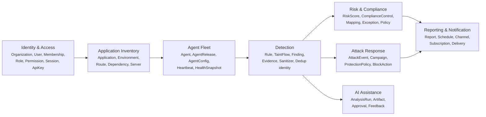
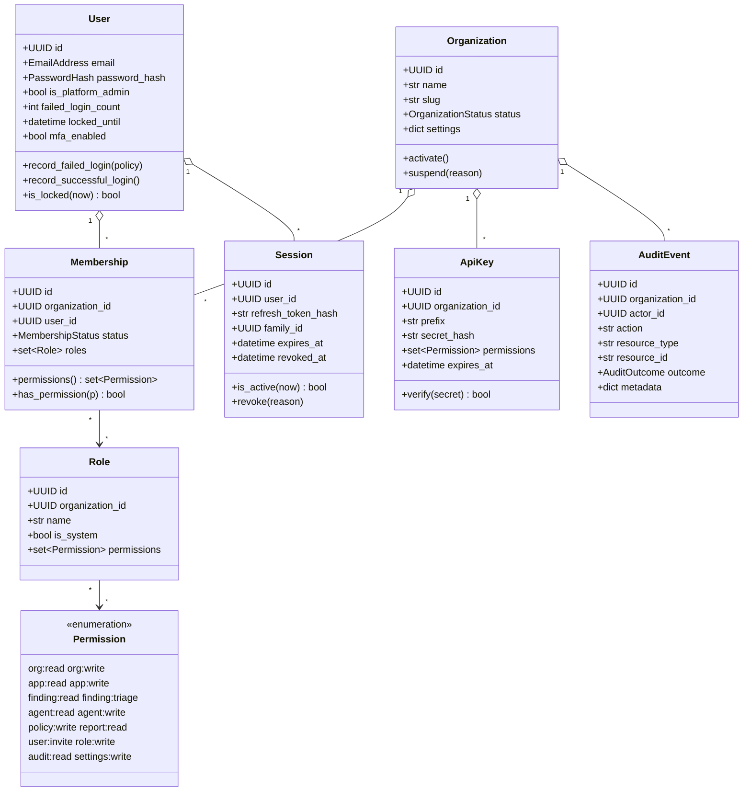
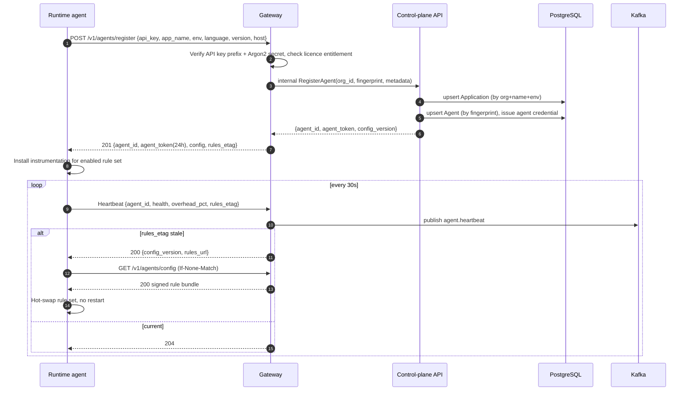
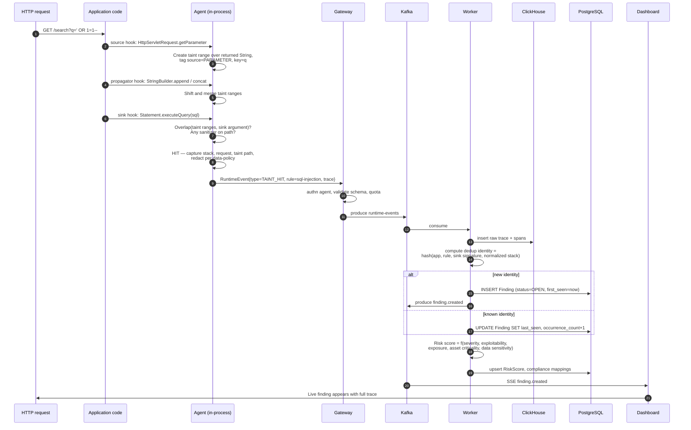
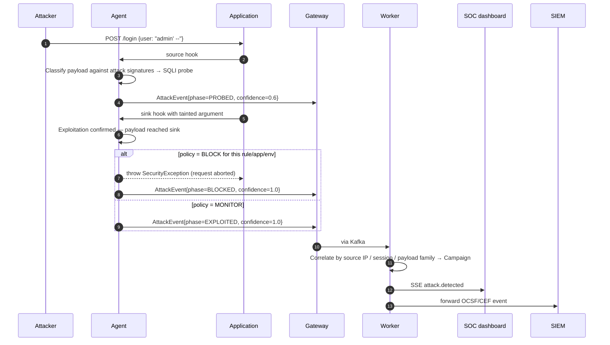
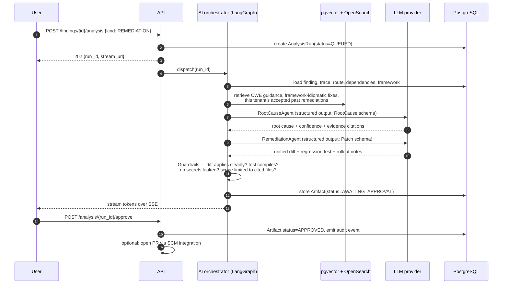
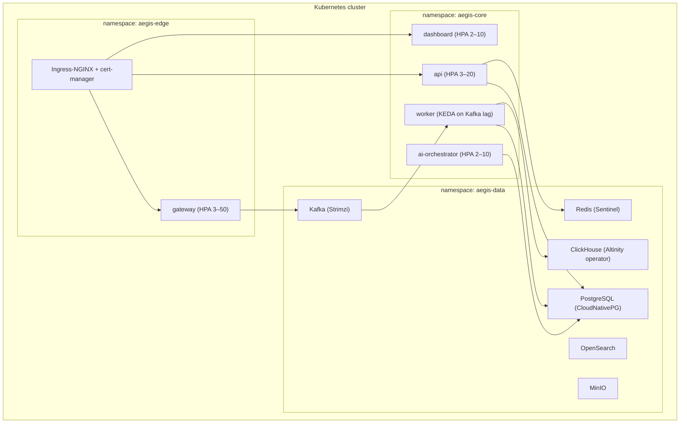

# Architecture

## 1. Architectural drivers

| Driver | Consequence |
|---|---|
| Agents run inside customer production processes | Agent must be fail-open, bounded-resource, and independently versioned from the control plane |
| Runtime event volume is 3–4 orders of magnitude above finding volume | Split hot path (append-only, columnar) from control plane (relational, transactional) |
| Multi-tenant SaaS *and* on-prem/air-gap | No cloud-managed-service lock-in; every dependency has a self-hostable form |
| Findings are evidence for compliance | Immutable audit trail, deterministic dedup identity, no destructive updates |
| Detection rules evolve weekly | Rules are data, shipped independently of agent binaries, versioned per tenant |
| AI is assistive, not authoritative | AI output is a separate, attributed, human-approvable artifact — never mutates a finding silently |

## 2. System context (C4 level 1)



## 3. Container view (C4 level 2)



### Container responsibilities

| Container | Responsibility | Explicitly not responsible for |
|---|---|---|
| `gateway` | Authenticate agents, validate wire schema, apply per-tenant quota and sampling, publish to Kafka. Stateless, horizontally scaled, no database writes on the hot path. | Business logic, correlation, storage |
| `api` | All user-facing reads and writes. Owns the relational model, RBAC, policy, licensing, audit. | Ingest, heavy computation |
| `worker` | Everything asynchronous: assembling traces into findings, deduplication, risk scoring, attack correlation, compliance rollups, report rendering, notifications. | Serving user requests |
| `ai-orchestrator` | LangGraph workflows. Stateless between runs; checkpoints in Postgres. | Being on any synchronous critical path |
| `dashboard` | Presentation. Server components for first paint, TanStack Query for live data, SSE/WebSocket for streaming. | Holding business rules |

## 4. Application architecture — hexagonal + DDD

Every Python service uses the same four-layer structure. Dependencies point strictly inward.

```
┌───────────────────────────────────────────────────────────────┐
│ interfaces/      HTTP routers, GraphQL resolvers, gRPC        │
│                  servicers, CLI, Celery task entrypoints      │
│                  → translate transport ⇄ application DTOs     │
├───────────────────────────────────────────────────────────────┤
│ infrastructure/  SQLAlchemy repositories, Redis cache, Kafka   │
│                  producer, ClickHouse client, Argon2 hasher,  │
│                  JWT codec, SMTP/Slack senders                │
│                  → implement the ports defined in domain      │
├───────────────────────────────────────────────────────────────┤
│ application/     Use cases (one class per business operation), │
│                  unit-of-work orchestration, authorization     │
│                  decisions, DTOs, application-level errors     │
├───────────────────────────────────────────────────────────────┤
│ domain/          Entities, value objects, aggregates, domain   │
│                  services, domain events, ports (Protocols),   │
│                  invariants. Zero third-party imports.         │
└───────────────────────────────────────────────────────────────┘
```

Rules enforced in CI (`scripts/check_layering.py`):

- `domain` may import only the standard library and `packages/shared` contracts.
- `application` may import `domain`. It may not import `sqlalchemy`, `fastapi`, `redis`, `kafka`.
- `infrastructure` and `interfaces` may import everything inward.
- Nothing imports `interfaces`.

### 4.1 Bounded contexts



Context relationships use published-language contracts in `packages/shared`; no context reaches into
another context's tables. Cross-context reads go through an application service or a Kafka event.

### 4.2 Identity & Access class model (implemented in Phase 2)



## 5. Key sequences

### 5.1 Agent registration and configuration



### 5.2 Vulnerability detection — source to finding



### 5.3 Attack detection and response



### 5.4 AI root cause and remediation (human-in-the-loop)



## 6. Data architecture

| Store | Contents | Why this store |
|---|---|---|
| PostgreSQL | Tenancy, identity, RBAC, applications, findings, policy, licensing, audit, AI runs, LangGraph checkpoints | Transactional integrity, relational queries, mature RLS |
| ClickHouse | Runtime events, taint traces, spans, attack telemetry, agent metrics | Columnar, 100k+ inserts/sec, cheap TTL tiering, fast aggregate scans |
| Redis | Session cache, rate limiting, idempotency keys, Celery broker, live-view fan-out | Sub-ms latency, expiring keys |
| Kafka | `runtime-events`, `findings`, `attacks`, `agent-lifecycle`, `notifications` | Durable buffer that decouples ingest spikes from analysis capacity |
| OpenSearch | Findings, trace text, runbooks, docs | Full-text and fuzzy search; RAG keyword leg |
| pgvector | Embeddings for RAG corpus | Keeps vector data inside the existing Postgres operational envelope |
| MinIO / S3 | Agent binaries, signed rule bundles, rendered reports, cold trace blobs | Cheap large-object storage; presigned distribution |

### Multi-tenancy

Shared-schema with a mandatory `organization_id` discriminator on every tenant-owned table
(see [ADR-0003](adr/0003-multi-tenancy-strategy.md)). Three enforcement layers:

1. **Repository layer** — `TenantScopedRepository` injects the predicate; no query builder is exposed
   that can omit it.
2. **PostgreSQL row-level security** — `app.current_organization_id` session GUC set per transaction,
   defence in depth against a repository bug.
3. **Test layer** — a cross-tenant isolation suite runs every endpoint as tenant B against tenant A's
   resource identifiers and asserts 404 (not 403 — we do not confirm existence).

## 7. Cross-cutting concerns

| Concern | Approach |
|---|---|
| Observability | OpenTelemetry traces/metrics/logs everywhere; `trace_id` propagated from agent through Kafka to worker; Prometheus `/metrics`; structured JSON logs with tenant and actor fields |
| Configuration | Pydantic Settings, 12-factor env vars, no secrets in images; Vault/KMS in production |
| Errors | RFC 9457 `application/problem+json`; domain errors mapped once, at the interface boundary |
| Idempotency | `Idempotency-Key` header on all unsafe API operations; agent events carry a client-side ULID |
| Versioning | URL-versioned API (`/v1`), additive-only within a major; agent wire protocol versioned in protobuf |
| Rate limiting | Token bucket per API key and per user in Redis; per-tenant ingest quota in the gateway |
| Backpressure | Gateway sheds by sampling low-value events first (heartbeats, metrics) and never drops findings or attacks |
| Fail-open | Any agent internal error disables the offending hook, reports it, and lets the application proceed |
| Secrets in evidence | Redaction runs *in the agent* before transmission, driven by tenant data policy |

## 8. Deployment topology



Environments: `local` (docker compose) → `dev` → `staging` → `production`. Terraform provisions cloud
infrastructure; Helm deploys workloads; GitHub Actions promotes immutable, signed images.

## 9. Architectural decisions

| ADR | Decision |
|---|---|
| [0001](adr/0001-monorepo.md) | Monorepo with per-app toolchains |
| [0002](adr/0002-hexagonal-architecture.md) | Hexagonal architecture with enforced layer boundaries |
| [0003](adr/0003-multi-tenancy-strategy.md) | Shared-schema tenancy with discriminator + RLS |
| [0004](adr/0004-polyglot-persistence.md) | PostgreSQL + ClickHouse split |
| [0005](adr/0005-agent-transport.md) | gRPC + protobuf agent transport with mTLS and pinning |
| [0006](adr/0006-token-strategy.md) | Short-lived JWT access + rotating opaque refresh with reuse detection |
| [0007](adr/0007-taint-model.md) | Range-based taint tracking with sanitizer awareness |
| [0008](adr/0008-ai-orchestration.md) | LangGraph orchestration with human approval gates |
| [0009](adr/0009-finding-identity.md) | Deterministic finding identity and deduplication |
