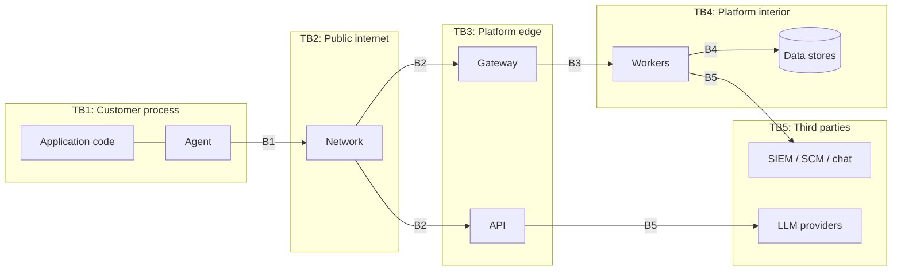

# Threat Model

Methodology: STRIDE per trust boundary, with a dedicated section for the risks unique to a product that
ships code into customer production processes. Risk rating is `Likelihood × Impact` on a 1–5 scale;
anything scoring ≥ 15 requires a compensating control before the relevant phase ships.

## 1. Assets

| # | Asset | Why an attacker wants it |
|---|---|---|
| A1 | Customer source-code fragments in traces | Reveals proprietary logic and further vulnerabilities |
| A2 | Unremediated vulnerability inventory | A ready-made target list for every customer application |
| A3 | Runtime data samples (may contain PII/PCI/PHI) | Direct data theft, regulatory impact |
| A4 | Agent credentials and rule bundles | Code execution inside customer production processes |
| A5 | Control-plane admin credentials | Full tenant takeover, cross-tenant pivot |
| A6 | Audit log | Cover tracks after intrusion |
| A7 | LLM provider keys | Cost abuse, exfiltration channel |
| A8 | Agent binaries / release channel | Supply-chain compromise of every customer |

## 2. Trust boundaries

## 3. STRIDE analysis

### B1/B2 — Agent → Platform

| ID | STRIDE | Threat | L | I | R | Control |
|---|---|---|---|---|---|---|
| T-01 | Spoofing | Attacker registers a rogue agent with a stolen API key and poisons a tenant's findings | 3 | 4 | 12 | API key = `prefix.secret`, secret stored Argon2id; per-agent short-lived token after registration; registration bound to fingerprint; anomalous registration rate alerts |
| T-02 | Tampering | MITM alters runtime events in flight | 2 | 4 | 8 | mTLS 1.3 only; certificate pinning in the agent; event payloads carry an HMAC over the agent credential |
| T-03 | Repudiation | Agent denies sending an event / platform denies receiving | 2 | 2 | 4 | ULID event IDs, server-side receipt log in ClickHouse, agent-side ack cursor |
| T-04 | Info disclosure | Traces exfiltrate customer secrets and PII to the platform | 4 | 5 | **20** | **Redaction in the agent before transmission**, driven by tenant data policy; default deny-list (password, token, secret, authorization, cookie, card patterns, national IDs); configurable value-capture mode `NONE / HASHED / TRUNCATED / FULL` per environment; documented data-processing agreement |
| T-05 | DoS | Compromised agent floods the gateway | 3 | 3 | 9 | Per-tenant and per-agent token buckets; gateway sheds by event class; Kafka absorbs bursts; agent-side circuit breaker caps its own emission rate |
| T-06 | EoP | Agent token reused to read control-plane data | 2 | 5 | 10 | Agent tokens carry only `agent:report` scope; separate audience claim; API rejects agent audience on user endpoints |

### B2 — User → Platform

| ID | STRIDE | Threat | L | I | R | Control |
|---|---|---|---|---|---|---|
| T-07 | Spoofing | Credential stuffing against the console | 5 | 4 | **20** | Argon2id (m=64 MiB, t=3, p=4); per-account throttling and lockout with exponential backoff; per-IP limits; TOTP MFA, mandatory for privileged roles; breached-password check; generic error messages |
| T-08 | Tampering | Refresh token theft used for persistent access | 3 | 4 | 12 | Opaque refresh tokens, hashed at rest, rotated on every use, **family-wide revocation on reuse detection**; bound to device fingerprint; 30-day absolute lifetime |
| T-09 | Info disclosure | Tenant A reads tenant B's findings via IDOR | 3 | 5 | **15** | Repository-level mandatory tenant predicate; Postgres RLS as second layer; 404-not-403 responses; automated cross-tenant test suite over every route |
| T-10 | EoP | A viewer escalates to admin by editing their own membership | 3 | 5 | **15** | Permission checks in the application layer, never in the router alone; role assignment requires `role:write`; a member can never grant a permission they do not hold; system roles immutable |
| T-11 | Repudiation | Admin deletes evidence of a config change | 2 | 4 | 8 | Append-only audit table, no UPDATE/DELETE grant for the application role, hash-chained sequence, optional WORM export |
| T-12 | Info disclosure | Reflected/stored XSS in the console leaks session | 3 | 4 | 12 | React auto-escaping, no `dangerouslySetInnerHTML` on agent-sourced data, strict CSP with nonces, tokens in memory only (refresh in `HttpOnly`+`Secure`+`SameSite=Strict` cookie) |
| T-13 | DoS | Expensive aggregate query used as an amplification vector | 3 | 3 | 9 | Query cost budget, mandatory pagination caps, per-tenant concurrent-query limits, ClickHouse `max_execution_time` |

### B3/B4 — Platform interior

| ID | STRIDE | Threat | L | I | R | Control |
|---|---|---|---|---|---|---|
| T-14 | Tampering | Malicious event payload triggers deserialization RCE in a worker | 2 | 5 | 10 | Protobuf/strict-JSON schema validation at the gateway; no pickle, no dynamic class loading; workers run non-root, read-only rootfs, seccomp |
| T-15 | Info disclosure | SQL injection in the platform's own API | 2 | 5 | 10 | SQLAlchemy parameter binding only; a lint rule bans raw f-string SQL; the platform runs its own agent against itself (dogfooding gate) |
| T-16 | EoP | Container escape from a worker into the cluster | 2 | 5 | 10 | Non-root, dropped capabilities, restricted PSS, network policies, per-service ServiceAccount with least privilege |
| T-17 | Info disclosure | Backup or ClickHouse tier exported without encryption | 2 | 5 | 10 | Encryption at rest everywhere, KMS-managed keys, quarterly restore test |

### B5 — Platform → Third parties

| ID | STRIDE | Threat | L | I | R | Control |
|---|---|---|---|---|---|---|
| T-18 | Info disclosure | Customer code and secrets sent to an LLM provider | 4 | 5 | **20** | Tenant-level AI opt-in, default off; secondary redaction pass before any prompt; zero-retention provider agreements; self-hosted vLLM for regulated tenants; every prompt/response logged for audit with the tenant's own retention |
| T-19 | Tampering | **Prompt injection** — attacker plants text in a request parameter that the RCA agent later reads as instruction | 4 | 4 | **16** | Untrusted evidence is enclosed in delimited, clearly-labelled data blocks; system prompt states that evidence is data, never instruction; structured output schemas constrain the response shape; the agent has no write tools — its output is an artifact requiring human approval; diffs are validated to touch only cited files |
| T-20 | Spoofing | Webhook receiver spoofed to feed false ticket updates | 3 | 3 | 9 | HMAC-signed webhooks with timestamp and replay window; allow-listed egress destinations |

## 4. Product-specific risks

### 4.1 Agent supply chain (A8) — the highest-consequence risk in the product

A compromised agent release executes attacker code in every customer's production application.

| Control | Detail |
|---|---|
| Reproducible builds | Pinned toolchains, hermetic build, checksum comparison across two independent builders |
| Artifact signing | Cosign signatures; the agent verifies the platform signature on rule bundles before load |
| SBOM | CycloneDX per release, published and attested (SLSA level 3 target) |
| Two-person release | Release requires two maintainer approvals; the signing key lives in an HSM |
| Staged rollout | Canary cohort → 5% → 25% → 100%, with automatic halt on error-rate or overhead regression |
| Customer pinning | Tenants may pin an exact agent version and disable auto-update entirely |
| Rule bundles ≠ code | Rule bundles are declarative data validated against a schema; they cannot introduce new executable behaviour |

### 4.2 Agent-induced application failure

The agent runs inside a business-critical process. An agent bug is a customer outage.

| Control | Detail |
|---|---|
| Fail-open by construction | Every hook body is wrapped; any exception disables that hook, increments a metric, and returns control to the application immediately |
| Resource governor | Overhead sampled continuously; exceeding the configured budget (default 5% CPU) degrades to sampling, then to detection-off, then to full self-uninstall |
| Bounded memory | Taint metadata stored in a bounded weak map with an LRU cap; request-scoped state hard-released at request end |
| No blocking I/O on the request path | Events go to a bounded in-memory ring buffer drained by a background thread; a full buffer drops events, never blocks the application |
| Kill switch | A remote flag disables all instrumentation within one heartbeat interval (30 s) without a restart |

### 4.3 Blocking mode (ADR) false positives

Blocking a legitimate request is a customer-visible incident.

- Default policy is `MONITOR` for every rule. Blocking is opt-in per rule, per application, per environment.
- Blocking triggers only on **exploitation-confirmed** events (payload reached a sink), never on
  pattern matches at the source alone.
- A mandatory 14-day monitor-mode soak, with a "would have blocked" counter, precedes enabling block.
- Per-route allow-lists and a one-click global disable.

### 4.4 Evidence integrity

Findings are used in audits and sometimes in legal proceedings.

- Findings are append-mostly: status transitions are recorded as events, never overwritten in place.
- Every evidence blob is content-addressed (SHA-256) and immutable.
- The audit chain hashes each entry with its predecessor; a verification job runs nightly.

## 5. Security requirements derived from this model

These are testable and are enforced by the Phase 2 test suite.

1. No endpoint returns a tenant-owned resource without a verified `organization_id` match.
2. Failed authentication responses are indistinguishable between "unknown user" and "wrong password",
   including in timing.
3. Refresh-token reuse revokes the entire token family and emits a `security.token_reuse` audit event.
4. No permission check exists solely in the HTTP layer; every use case authorizes independently.
5. The audit table has no UPDATE or DELETE grant for the application database role.
6. Any evidence field matching the redaction policy is redacted before it leaves the agent process.
7. All secrets are read from the environment; a build fails if a high-entropy literal is committed.
8. Agent tokens carry the `agent` audience and are rejected by every user-facing endpoint.
