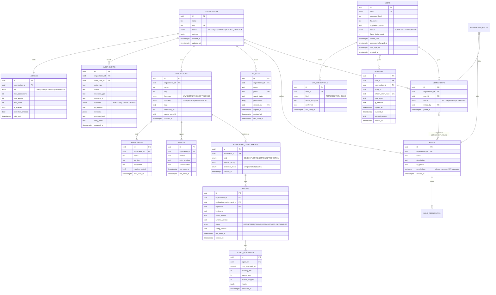

# Data Model

## 1. Conventions

| Convention | Rule |
|---|---|
| Primary keys | `UUID` (v7 where available — time-ordered, index-friendly) |
| Tenant discriminator | Every tenant-owned table carries a non-null `organization_id` with an FK and a leading composite index |
| Timestamps | `created_at`, `updated_at` — `TIMESTAMPTZ`, UTC, database-defaulted |
| Soft delete | Only where an audit trail requires it (`deleted_at`); otherwise hard delete with cascade |
| Enumerations | PostgreSQL native `ENUM` for closed sets; `TEXT` + check constraint where values evolve fast |
| Money/scores | `NUMERIC(6,2)` for scores; never floats |
| Naming | `snake_case`, plural table names, `fk_`/`ix_`/`uq_`/`ck_` constraint prefixes |
| Migrations | Alembic, forward-only in production, every migration reversible in development |

## 2. ERD — Phase 2 (Identity, Tenancy, Inventory, Fleet)



## 3. ERD — Phase 5+ (Detection, Risk, Response, AI)

```mermaid
erDiagram
    APPLICATIONS ||--o{ FINDINGS : contains
    DETECTION_RULES ||--o{ FINDINGS : produces
    FINDINGS ||--o{ FINDING_EVENTS : transitions
    FINDINGS ||--o{ EVIDENCE : proves
    FINDINGS ||--|| RISK_SCORES : scored_by
    FINDINGS }o--o{ COMPLIANCE_CONTROLS : maps_to
    FINDINGS ||--o{ ANALYSIS_RUNS : analysed_by
    ANALYSIS_RUNS ||--o{ AI_ARTIFACTS : produces
    APPLICATIONS ||--o{ ATTACK_EVENTS : targeted_by
    ATTACK_EVENTS }o--|| ATTACK_CAMPAIGNS : belongs_to
    ORGANIZATIONS ||--o{ PROTECTION_POLICIES : configures

    DETECTION_RULES {
        uuid id PK
        text key UK "sql-injection, path-traversal, ..."
        text title
        enum severity "INFO|LOW|MEDIUM|HIGH|CRITICAL"
        int cwe_id
        text cvss_vector
        text[] languages
        jsonb definition "sources, propagators, sinks, sanitizers"
        int version
        bool enabled_by_default
    }
    FINDINGS {
        uuid id PK
        uuid organization_id FK
        uuid application_id FK
        uuid application_environment_id FK
        uuid rule_id FK
        text identity_hash UK "dedup key"
        enum status "OPEN|CONFIRMED|IN_PROGRESS|REMEDIATED|ACCEPTED_RISK|FALSE_POSITIVE"
        enum severity
        enum confidence "OBSERVED|CONFIRMED|EXPLOITED"
        text sink_signature
        text source_kind
        text route_method
        text route_path
        int occurrence_count
        timestamptz first_seen_at
        timestamptz last_seen_at
        timestamptz remediated_at
    }
    FINDING_EVENTS {
        uuid id PK
        uuid finding_id FK
        text from_status
        text to_status
        uuid actor_user_id FK
        text reason
        timestamptz occurred_at
    }
    EVIDENCE {
        uuid id PK
        uuid finding_id FK
        text content_hash UK
        enum kind "TAINT_TRACE|STACK|HTTP_REQUEST|CONFIG_SNAPSHOT"
        text storage_uri
        bool redacted
        timestamptz captured_at
    }
    RISK_SCORES {
        uuid finding_id PK_FK
        numeric base_severity
        numeric exploitability
        numeric exposure
        numeric asset_criticality
        numeric data_sensitivity
        numeric composite
        jsonb explanation
        timestamptz computed_at
    }
    COMPLIANCE_CONTROLS {
        uuid id PK
        text framework "PCI_DSS_4|SOC2|ISO27001|NIST_800_53|OWASP_ASVS"
        text control_id
        text title
    }
    ATTACK_EVENTS {
        uuid id PK
        uuid organization_id FK
        uuid application_id FK
        uuid campaign_id FK
        text rule_key
        enum phase "PROBED|EXPLOITED|BLOCKED|SUPPRESSED"
        numeric confidence
        inet source_ip
        text source_country
        text payload_hash
        jsonb request_summary
        timestamptz occurred_at
    }
    ATTACK_CAMPAIGNS {
        uuid id PK
        uuid organization_id FK
        text signature
        int event_count
        int application_count
        enum severity
        timestamptz started_at
        timestamptz last_event_at
    }
    PROTECTION_POLICIES {
        uuid id PK
        uuid organization_id FK
        uuid application_environment_id FK
        text rule_key
        enum mode "OFF|MONITOR|BLOCK"
        int soak_days_completed
        int would_have_blocked_count
        timestamptz updated_at
    }
    ANALYSIS_RUNS {
        uuid id PK
        uuid organization_id FK
        uuid finding_id FK
        enum kind "ROOT_CAUSE|REMEDIATION|EXEC_SUMMARY|CORRELATION"
        enum status "QUEUED|RUNNING|AWAITING_APPROVAL|APPROVED|REJECTED|FAILED"
        text model
        int prompt_tokens
        int completion_tokens
        numeric cost_usd
        uuid requested_by FK
        timestamptz started_at
        timestamptz finished_at
    }
    AI_ARTIFACTS {
        uuid id PK
        uuid analysis_run_id FK
        enum kind "ROOT_CAUSE|PATCH|TEST|NARRATIVE"
        jsonb content
        numeric confidence
        text[] citations
        uuid approved_by FK
        timestamptz approved_at
    }
```

### 3.1 Finding identity (deduplication)

A finding's `identity_hash` is deterministic so that the same flaw seen a million times is one row:

```
identity_hash = sha256(
    organization_id || application_id || rule_key ||
    normalized(sink_signature) ||          # class#method(descriptor), no line numbers
    normalized(source_kind) ||             # PARAMETER, HEADER, BODY, ...
    stack_fingerprint                      # top N application frames, package-normalized,
)                                          # framework/library frames excluded
```

Line numbers and library frames are deliberately excluded so that a refactor or a dependency bump does
not resurrect a closed finding. See [ADR-0009](adr/0009-finding-identity.md).

## 4. ClickHouse event schema

Runtime telemetry never touches PostgreSQL. It lands in ClickHouse, partitioned by day, TTL-tiered.

```sql
CREATE TABLE runtime_events
(
    event_id            UUID,
    organization_id     UUID,
    application_id      UUID,
    environment         LowCardinality(String),
    agent_id            UUID,
    trace_id            String,
    span_id             String,
    event_type          LowCardinality(String),   -- TAINT_HIT | ATTACK | ROUTE | DEPENDENCY | CONFIG | METRIC
    rule_key            LowCardinality(String),
    severity            LowCardinality(String),
    confidence          Float32,
    route_method        LowCardinality(String),
    route_path          String,
    source_kind         LowCardinality(String),
    sink_signature      String,
    stack_fingerprint   String,
    taint_path          String,                   -- JSON, redacted
    request_summary     String,                   -- JSON, redacted
    source_ip           IPv6,
    duration_us         UInt32,
    occurred_at         DateTime64(3, 'UTC'),
    ingested_at         DateTime64(3, 'UTC') DEFAULT now64(3)
)
ENGINE = MergeTree
PARTITION BY toYYYYMMDD(occurred_at)
ORDER BY (organization_id, application_id, occurred_at, event_type)
TTL occurred_at + INTERVAL 30 DAY TO VOLUME 'cold',
    occurred_at + INTERVAL 365 DAY DELETE
SETTINGS index_granularity = 8192;

CREATE TABLE agent_metrics
(
    organization_id UUID,
    agent_id        UUID,
    cpu_pct         Float32,
    memory_mb       UInt32,
    events_sent     UInt32,
    events_dropped  UInt32,
    hooks_disabled  UInt16,
    observed_at     DateTime64(3, 'UTC')
)
ENGINE = MergeTree
PARTITION BY toYYYYMM(observed_at)
ORDER BY (organization_id, agent_id, observed_at)
TTL observed_at + INTERVAL 90 DAY;

-- Rollup that powers the dashboard's finding-trend charts without scanning raw events.
CREATE MATERIALIZED VIEW findings_hourly
ENGINE = SummingMergeTree
PARTITION BY toYYYYMM(hour)
ORDER BY (organization_id, application_id, rule_key, severity, hour)
AS SELECT
    organization_id, application_id, rule_key, severity,
    toStartOfHour(occurred_at) AS hour,
    count() AS hits
FROM runtime_events
WHERE event_type = 'TAINT_HIT'
GROUP BY organization_id, application_id, rule_key, severity, hour;
```

## 5. Indexing strategy (PostgreSQL)

| Table | Index | Rationale |
|---|---|---|
| `memberships` | `uq(organization_id, user_id)` | One membership per user per org |
| `memberships` | `ix(user_id)` | "Which orgs am I in" on every login |
| `sessions` | `uq(refresh_token_hash)`, `ix(family_id)`, `ix(user_id, expires_at)` | Rotation and family revocation |
| `api_keys` | `uq(prefix)` | Constant-time key lookup before the expensive Argon2 verify |
| `findings` | `uq(organization_id, identity_hash)` | Dedup upsert target |
| `findings` | `ix(organization_id, status, severity, last_seen_at DESC)` | The default dashboard query |
| `findings` | `ix(application_id, status) WHERE status IN ('OPEN','CONFIRMED')` | Partial index for the hot subset |
| `audit_events` | `ix(organization_id, occurred_at DESC)`, `ix(actor_user_id, occurred_at DESC)` | Audit browsing |
| `agents` | `uq(fingerprint)`, `ix(organization_id, status, last_seen_at)` | Fleet health |
| `attack_events` | `ix(organization_id, occurred_at DESC)`, `ix(campaign_id)` | SOC live feed |

## 6. Row-level security

Applied to every tenant-owned table (`licenses`, `roles`, `memberships`, `api_keys`, `applications`,
`application_environments`, `agents`, `audit_events`):

```sql
ALTER TABLE applications ENABLE ROW LEVEL SECURITY;
ALTER TABLE applications FORCE ROW LEVEL SECURITY;

CREATE POLICY tenant_isolation ON applications
    USING (
        organization_id = NULLIF(current_setting('app.current_organization_id', true), '')::uuid
        OR current_setting('app.rls_bypass', true) = 'on'
    )
    WITH CHECK (
        organization_id = NULLIF(current_setting('app.current_organization_id', true), '')::uuid
        OR current_setting('app.rls_bypass', true) = 'on'
    );
```

The application sets `app.current_organization_id` with `set_config(..., is_local => true)` at the
start of every transaction, from the authenticated principal. Transaction-local matters behind a
connection pool: a session-level setting would leak into whichever request reused the connection next.

**`FORCE` is not optional.** Without it, the table owner — which in most deployments is the
application role — bypasses the policy entirely and the control is decorative.

### 6.1 The `app.rls_bypass` escape

Two operations legitimately run before any tenant is known, because they are how the tenant gets
discovered:

| Operation | Why it precedes tenant binding |
|---|---|
| "Which organizations may this user sign in to?" | The tenant is not known until credentials are verified |
| API-key lookup by public prefix | The key's organization *is* the answer being sought |

Both raise `app.rls_bypass` around a single statement and lower it immediately in a `finally`. Both
are keyed by a unique identifier, return no tenant-owned data, and are followed by a credential check
before anything is granted. No other code path may set the flag.

### 6.2 The application must not be a superuser

PostgreSQL superusers bypass row-level security **entirely**, even with `FORCE` set. Connecting the
application as one silently removes the second of the two isolation controls while every policy still
appears to be in place.

- `scripts/postgres/app-role.sql` creates the least-privilege `aegis_app` role and its grants.
- The API checks `pg_roles.rolsuper` at startup: it logs a warning in development and **refuses to
  start** in staging or production.
- The test suite creates a `NOSUPERUSER` role and connects as it, so the isolation tests are testing
  something real.

Platform-admin operations that must span tenants use a separate role and are reachable only through
explicitly audited code paths.

### 6.3 Append-only audit

`audit_events` is protected twice over:

1. A `BEFORE UPDATE OR DELETE` trigger raises `insufficient_privilege`.
2. The application role has `INSERT` and `SELECT` only — `UPDATE` and `DELETE` are revoked.

Because the role lacks `UPDATE`, the append path cannot use `SELECT ... FOR UPDATE` to serialize
sequence allocation. It takes a transaction-scoped advisory lock keyed on the organization instead;
the unique constraint on `(organization_id, sequence)` remains the backstop.

## 7. Retention and lifecycle

| Data | Hot | Cold | Delete |
|---|---|---|---|
| Findings (PostgreSQL) | indefinite | — | on tenant deletion |
| Raw runtime events (ClickHouse) | 30 d | 365 d | automatic TTL |
| Agent metrics | 90 d | — | automatic TTL |
| Audit events | 7 y | — | never (regulatory) |
| Sessions | until expiry | — | nightly purge of expired |
| AI runs and artifacts | 2 y | — | on tenant request |
| Evidence blobs (S3) | 30 d standard | 1 y glacier | with parent finding |

Tenant deletion is a two-phase operation: `PENDING_DELETION` for 30 days (recoverable), then a purge
job that removes rows across PostgreSQL, ClickHouse, OpenSearch and object storage, writing a final
signed deletion certificate to the audit log.
