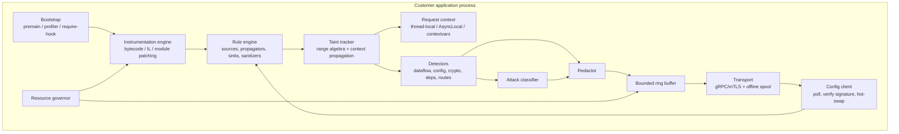

# Runtime Agent Design

The agent is the product. Everything else is a way to store, reason about, and present what the agent
sees. This document specifies the design shared by all five language agents and the per-language
mechanics that differ.

## 1. Design principles

1. **Never break the application.** Every hook is wrapped; any internal error disables that hook and
   returns control immediately. There is no code path in which an agent exception propagates into
   application code.
2. **Bounded cost.** CPU, memory, and event volume are governed with hard ceilings and automatic
   degradation. The agent measures its own overhead and will uninstall itself before it becomes an
   incident.
3. **Never block.** No network or disk I/O on the request thread. Events go into a bounded ring buffer
   drained by a background thread; a full buffer drops, it does not wait.
4. **Redact at the source.** Sensitive values are redacted inside the customer's process, before
   anything crosses the network.
5. **Data, not code, ships weekly.** Detection rules are declarative bundles validated against a
   schema. New detections do not require a new agent binary.

## 2. Component model



## 3. The taint model

### 3.1 Vocabulary

| Term | Definition | Examples |
|---|---|---|
| **Source** | An API returning attacker-controllable data | `request.getParameter`, header/cookie/body readers, message-queue payloads, file uploads, database reads (second-order) |
| **Propagator** | An operation that carries taint from input to output | `concat`, `substring`, `StringBuilder.append`, `format`, `toLowerCase`, JSON/XML serialization, ORM parameter binding |
| **Sanitizer** | An operation that removes taint for a specific rule class | `PreparedStatement` binding (SQLi), HTML entity encoding (XSS), `Path.normalize` + allow-list (traversal), parameterized LDAP filters |
| **Validator** | An operation that narrows taint without removing it | regex match, length check, enum membership — downgrades confidence, does not clear taint |
| **Sink** | A security-sensitive operation | `Statement.execute`, `Runtime.exec`, `new File`, `ObjectInputStream.readObject`, template render, `Cipher.getInstance`, HTTP client |

### 3.2 Range-based tracking

Taint is tracked as byte/char **ranges** over a value, not as a boolean. This is what lets the platform
distinguish "the whole query is attacker-controlled" from "one bound parameter is" and to show the user
exactly which characters are theirs.

```
value:  SELECT * FROM users WHERE name = 'alice' AND role = 'admin'
ranges:                                   ^^^^^ [PARAMETER:name, 41..46]
```

Operations transform ranges:

| Operation | Range transform |
|---|---|
| `concat(a, b)` | ranges(a) ∪ shift(ranges(b), len(a)) |
| `substring(i, j)` | intersect each range with [i, j), shift by −i |
| `replace(x, y)` | recompute offsets; taint is preserved unless the rule marks the replacement as sanitizing |
| `toUpperCase` / `trim` | offsets adjusted, tags preserved |
| `sanitize_html(a)` | ranges(a) with the `XSS` tag cleared; other tags retained |

A sink hit fires when a tainted range **overlaps** the security-relevant portion of a sink argument and
no sanitizer for that rule class appears on the path. Confidence:

| Path | Confidence |
|---|---|
| Tainted range reaches sink, no sanitizer, no validator | `CONFIRMED` |
| Tainted range reaches sink through a validator only | `OBSERVED` (reported at reduced severity) |
| Tainted range reaches sink *and* the payload matched an attack signature | `EXPLOITED` |
| Sanitizer present for the rule class | not reported |

#### The `+` operator is not `StringBuilder`

Worth stating explicitly, because it is the difference between an agent that works and one that
appears to. Since Java 9 the compiler does **not** lower `"a" + b` to a `StringBuilder`; it emits an
`invokedynamic` whose bootstrap method asks `java.lang.invoke.StringConcatFactory` to spin a bespoke
method handle. An agent that instruments `StringBuilder` alone therefore misses the single most common
way SQL injection is written in Java — and misses it *silently*, which is the worst possible failure
for a security tool, because the report still comes back clean.

The JVM agent instruments the factory itself and rewrites the call site when it links, so the cost is
paid once per site rather than once per concatenation. Argument offsets are reconstructed from the
concat **recipe** — the layout string the factory is handed — rather than by searching the result for
each argument, which would be slower and would mis-attribute a value that appears twice. If the
reconstructed length disagrees with the actual result, propagation is abandoned: a finding pointing at
the wrong characters is worse than no finding at all.

Call sites in platform classes (`java.*`, `jdk.*`, `sun.*`) are left alone. The JDK concatenates
constantly — logging, formatting, exception messages, class loading — and none of it is a place a
customer's injection is written. Wrapping those sites measured as more overhead than every other hook
combined, for no detection whatsoever.

### 3.3 Context propagation

Request context must follow the request across threads, executors, and async boundaries — otherwise
taint is lost at the first `CompletableFuture` and the product silently under-reports.

| Runtime | Mechanism |
|---|---|
| JVM | Single per-thread state holder + instrumentation of `Executor.execute` and `submit(Runnable\|Callable)`. `CompletableFuture`, Reactor and RxJava hooks are **not yet implemented** |
| .NET | `AsyncLocal<T>` — flows across `await` natively |
| Node.js | `AsyncLocalStorage` over `async_hooks` |
| Python | `contextvars` — flows into `asyncio` tasks; explicit copy for thread pools |
| Go | `context.Context` threading, injected at compile time |

### 3.4 Storing taint metadata without leaking memory

Taint metadata cannot live on the value itself for immutable built-ins. Each runtime uses a
**bounded, weakly-referenced side table** keyed by object identity:

- JVM: identity-keyed table, capped per request, cleared at request end. Identity, not equality —
  two equal strings are not the same value, and conflating them would attribute one request's taint to
  another's data, reporting every query that happens to contain a word a user typed.
- Node/Python: `WeakMap` / `WeakValueDictionary` with the same request-scoped teardown.

Hard rules: the table is capped (default 10,000 entries per request); on overflow the agent stops
tracking new values for that request and increments `taint_table_overflow`; the whole table is released
at request completion regardless of outcome.

## 4. Detection families

| Family | Detection basis | Example rules |
|---|---|---|
| Dataflow | Taint source → sink | SQLi, NoSQLi, command injection, path traversal, SSRF, XSS (reflected/stored), LDAP/XPath/expression injection, unsafe deserialization, open redirect, log injection, header injection |
| Configuration | Framework/config introspection at startup | Missing security headers, cookies without `Secure`/`HttpOnly`/`SameSite`, verbose errors in production, directory listing, CSRF protection disabled, permissive CORS |
| Cryptography | Sink argument inspection | Weak hash (MD5/SHA-1) for credentials, ECB mode, hardcoded key/IV, insecure random for tokens, disabled certificate validation |
| Authentication / Authorization | Framework hook observation | Unauthenticated sensitive route, missing authorization check on a state-changing route, session fixation, weak session entropy |
| Dependencies | Loaded-class/module inventory | Vulnerable library **with the vulnerable method actually invoked** (runtime reachability) |
| Sensitive data | Value classification at boundaries | PII/PCI/PHI written to logs, sent to a third-party host, or stored unencrypted |
| API surface | Route registration + observed traffic | Undocumented endpoints, verb tampering surface, missing rate limiting |

### What the JVM agent implements today

Dataflow only, and all eleven of its rule classes:

| Rule class | Sink | Recognised sanitizer |
|---|---|---|
| `sql-injection` | `Statement.execute*(String)` | parameter binding (`PreparedStatement` is not a sink) |
| `command-injection` | `Runtime.exec(String)` | — |
| `path-traversal` | `new File(String)` | — |
| `reflected-xss` | the response's own writer, matched by identity | commons-text / commons-lang / Spring `HtmlUtils` / OWASP encoder |
| `open-redirect` | `HttpServletResponse.sendRedirect` | `URLEncoder.encode` |
| `header-injection` | `setHeader` / `addHeader`, name **and** value | `URLEncoder.encode` |
| `ssrf` | `new URL(String)` | `URLEncoder.encode` |
| `ldap-injection` | `DirContext.search(_, filter, _)` | ESAPI `encodeForLDAP` / `encodeForDN` |
| `xpath-injection` | `XPath.compile` / `evaluate` | ESAPI `encodeForXPath` |
| `log-injection` | SLF4J and `java.util.logging` | — |
| `unsafe-deserialization` | `new ObjectInputStream(in)` | — |

### Measured against the OWASP Benchmark

All 2,740 cases of OWASP Benchmark v1.2, run against Tomcat 9 with the agent attached and scored
against the published answer key (`scripts/benchmark/run_owasp_benchmark.py`):

| Category | Cases | Recall | False positives |
|---|---|---|---|
| `xpathi` | 35 | 66.7% | 0% |
| `xss` | 455 | 61.4% | 0% |
| `sqli` | 504 | 58.8% | 0% |
| `cmdi` | 251 | 45.2% | 0% |
| `pathtraver` | 268 | 36.1% | 0% |
| `ldapi` | 59 | *not exercised* | — |
| **In scope** | **1,572** | **52.0%** | **0.0%** |

**Zero false positives**, on a suite built specifically to bait scanners with near-miss variants.
That is the number the identity-keyed taint table and per-rule sanitizers exist to protect, and it
is worth more than recall: one false positive on correct code costs more trust than ten true
positives earn.

`ldapi` reads 0/27 but was never measured — the Benchmark's embedded ApacheDS did not start, so
every case threw `CommunicationException` at `getDirContext()` before reaching a sink. Excluding it,
recall is 53.8%.

**Recall is 52%. The 366 remaining misses have been characterised** — every group below has a named
cause, measured by cross-referencing each missed case's source against the cases that were found.

| # | Cause | Cases | Kind |
|---|---|---|---|
| 1 | `getParameterValues` with no intervening transform | ~40 | **unexplained — largest group, needs a trace** |
| 2 | `Base64.decode` → `byte[]` → `new String(bytes)` | ~32 | missing propagator pair |
| 3 | ESAPI encoder methods used as pass-throughs | ~29 | missing propagators |
| 4 | `getQueryString` (with and without `substring`) | ~31 | unexplained; the source is hooked |
| 5 | `getHeader`/`getHeaders` beyond the enumeration wrapper | ~39 | partially addressed |
| 6 | Cookie-sourced | ~60 | **unexplained — five theories eliminated** |
| 7 | `StringBuilder.replace`/`reverse` | ~40 | missing propagators |
| 8 | `String.split` | ~25 | missing propagator |
| 9 | `getHeaderNames()` | ~14 | source not implemented |

**Groups 2, 3, 7 and 8 are implementable now** — roughly 126 cases, all of them the same shape of work
as the `URLDecoder` propagator that took recall from 35.8% to 52.0%. `Base64` in particular is a chain
the engine already almost handles: `String.getBytes` propagates for deserialization, so only
`Base64.Decoder.decode` and `new String(byte[])` are missing.

**Groups 1, 4 and 6 are unexplained and must be traced, not guessed at.** All three involve sources
that are hooked and demonstrably work in the corpus. Five separate hypotheses for group 6 were
investigated and every one was wrong, which is the reason this table exists: a target set over an
uncharacterised tail is a target set over an assumption.

Two further gaps, known and unmeasured against the Benchmark:

- **Request-body sources** — `getReader` and `getInputStream`, currently reported as a coverage gap
  rather than tracked.
- **Second-order flows** through session attributes and the database.

Each is additive work against a taint engine that has already been shown correct, not a redesign.

The other six families in the table above — configuration, cryptography, authn/authz, dependencies,
sensitive data, API surface — are **not implemented** in the JVM agent.

Two notes on the harder entries. **XSS** is a sink on the response, but the write happens on a
`Writer` that has no idea it belongs to one; instrumenting every writer and reporting on all of them
would flag `System.out`. The object the response hands out is remembered instead, and the write is
checked against it by identity. **Deserialization** is the only sink whose dangerous value is not a
string: taint arrives as a parameter, becomes bytes, becomes a stream, and only then reaches Java
serialization — which is why the taint table is keyed on object identity rather than on character
data. Its sink is the `ObjectInputStream` constructor, not `readObject`, because the constructor
already reads and validates the stream header: a hostile payload that is not well-formed throws
there, and a sink on `readObject` would never see the attempt.

## 5. Per-language instrumentation

| Runtime | Entry point | Instrumentation technology | Notes |
|---|---|---|---|
| **Java / JVM** | `-javaagent:aegis.jar` (`premain`), `agentmain` for attach | ASM via Byte Buddy, `ClassFileTransformer` | Frameworks: Servlet, Spring MVC/WebFlux, JAX-RS, Micronaut, Quarkus, Struts, JDBC, JPA/Hibernate, MyBatis, Jackson, Log4j/Logback. Must handle: shaded jars, OSGi/multiple classloaders, `String` being in the bootstrap classloader (helper classes are injected into bootstrap), Java module boundaries, GraalVM native-image exclusion |
| **.NET / CLR** | `CORECLR_PROFILER` env, `ICorProfilerCallback` | IL rewriting at JIT time + Harmony for managed patching | Frameworks: ASP.NET Core middleware pipeline, EF Core, ADO.NET, Dapper, Newtonsoft/System.Text.Json. Must handle: ReadyToRun/tiered compilation, single-file publish, `AsyncLocal` flow |
| **Node.js** | `--require @aegis/agent` or `NODE_OPTIONS` | `Module._load` patching + `import-in-the-middle` for ESM | Frameworks: Express, Koa, Fastify, NestJS, Next.js route handlers, `pg`/`mysql2`/`mongodb`/`knex`/`sequelize`/`prisma`, `child_process`, `fs`. Must handle: ESM vs CJS, bundlers that inline dependencies (documented limitation), worker threads |
| **Python** | `sitecustomize` / `aegis-run` wrapper | `sys.monitoring` (3.12+) with a `MetaPathFinder` + wrapt function wrapping fallback | Frameworks: Django, Flask, FastAPI/Starlette, SQLAlchemy, psycopg, asyncpg, `subprocess`, `os`, Jinja2, pickle/yaml. Must handle: C-extension boundaries (taint is lost through native code — reported as a coverage gap, not silently) |
| **Go** | Build-time source rewriting (`aegis build`) | AST instrumentation over the module graph, `//go:linkname` for stdlib | No runtime bytecode manipulation exists, so Go instrumentation is compile-time. Frameworks: net/http, Gin, Echo, Chi, `database/sql`, `os/exec`. Ships as a `go build` wrapper and a toolexec plugin |

### Coverage honesty

Where a runtime cannot track taint (C extensions, native interop, bundled/minified code, reflection
through dynamic proxies), the agent emits a `coverage_gap` event rather than silently producing a
clean bill of health. The dashboard shows per-application instrumentation coverage as a first-class
metric — a low-coverage application with zero findings is displayed as *unknown*, not *secure*.

## 6. Resource governor

```
sample every 10s:
    cpu_pct  = agent_cpu_time_delta / process_cpu_time_delta
    mem_mb   = agent_arena_resident

if cpu_pct > budget (default 5%)          -> level 1: sample 25% of requests
if cpu_pct > budget * 1.5 for 3 samples   -> level 2: dataflow off, config/deps only
if cpu_pct > budget * 2.0 for 3 samples   -> level 3: detection off, heartbeat only
if cpu_pct > budget * 3.0                 -> level 4: full uninstall, alert control plane

recovery: one level per 5 consecutive samples under 60% of budget
```

Every level transition is an event; the fleet view shows degraded agents and why.

## 7. Transport and offline operation

| Property | Design |
|---|---|
| Protocol | gRPC bidirectional stream over mTLS 1.3; HTTP/JSON+NDJSON fallback |
| Compression | zstd, falling back to gzip |
| Certificate pinning | SPKI pin set with a primary and a rollover pin, both shipped in the agent |
| Batching | Up to 512 events or 2 s, whichever first |
| Backpressure | Server `IngestAck` carries a credit window; the agent throttles to it |
| Offline mode | Disk spool at a configurable path, capped (default 256 MB), FIFO eviction; replayed on reconnect with original timestamps and a `replayed=true` flag |
| Clock skew | Agent sends monotonic delta plus wall clock; the server records both |
| Ack semantics | At-least-once; events carry a ULID and the server deduplicates |

## 8. Configuration and updates

- The agent polls `FetchConfig` on every heartbeat with the current `rules_etag`.
- Rule bundles are **signed**; the agent verifies the signature against a pinned public key before load
  and refuses unsigned or mis-signed bundles.
- Rule swaps are hot — the rule engine is a versioned immutable structure swapped atomically.
- Binary self-update is opt-in per tenant, staged, and always reversible to the pinned version.
- A remote kill switch disables all instrumentation within one heartbeat interval.

## 9. Local configuration surface

```yaml
aegis:
  api_key: ${AEGIS_API_KEY}
  endpoint: https://ingest.aegis.dev:443
  application:
    name: payments-api
    environment: PRODUCTION
  overhead:
    cpu_budget_pct: 5
    max_memory_mb: 150
  capture:
    request_body: TRUNCATED      # NONE | HASHED | TRUNCATED | FULL
    max_value_length: 512
    redact_keys: [password, token, secret, authorization, cookie, ssn, card]
  offline:
    spool_dir: /var/lib/aegis/spool
    max_spool_mb: 256
  protection:
    mode: MONITOR                # OFF | MONITOR | BLOCK
  logging:
    level: WARN
    file: /var/log/aegis/agent.log
```

Every key is overridable by environment variable (`AEGIS_CAPTURE_REQUEST_BODY=NONE`) and by remote
configuration, in that precedence order: local file < environment < remote (remote may only *reduce*
data capture, never increase it beyond the locally configured maximum — the customer keeps the veto).

## 10. Agent test strategy

| Layer | Approach |
|---|---|
| Unit | Range algebra, redaction, governor state machine, ring buffer — pure, exhaustive, property-based |
| Instrumentation | Golden bytecode tests: instrument a fixture class, assert the emitted bytecode and that it verifies |
| Benchmark | JMH (JVM) / equivalent — overhead assertions run in CI and fail the build on regression beyond budget |
| Vulnerable-app corpus | OWASP WebGoat, Benchmark, Juice Shop, DVWA and per-language equivalents; asserted true-positive and false-positive rates gate every release |
| Framework matrix | A grid of framework × version fixtures, each exercised end-to-end against a live control plane |
| Chaos | Control plane unreachable, TLS failure, disk full, clock jump, OOM pressure — the application must remain healthy in every case |
