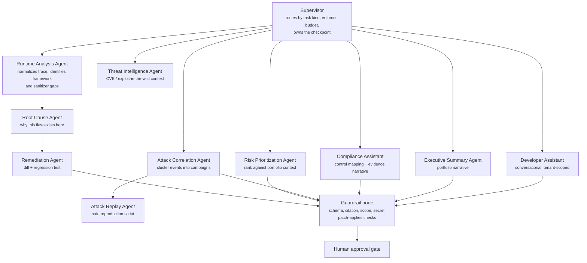

# AI Architecture

## 1. Position of AI in the product

AI is an **assistive layer over evidence the platform already possesses**. It never produces a finding,
never changes a finding's status, and never writes to a customer repository without human approval. If
the AI layer is disabled — and it is off by default for new tenants — every detection capability still
works.

This constraint is not conservatism; it is what makes the output trustworthy. The models operate on a
complete, structured trace (source, propagators, sink, stack, framework, dependency versions, route),
so they are asked to *explain and fix* a proven fact, not to *guess* whether a flaw exists.

## 2. Agent topology



### Agent contracts

| Agent | Input | Output schema | Tools |
|---|---|---|---|
| Runtime Analysis | Raw taint trace, stack, route, dependencies | `TraceAnalysis{framework, entrypoint, sanitizers_present[], data_classes[], coverage_gaps[]}` | `get_trace`, `get_dependencies`, `get_route` |
| Root Cause | `TraceAnalysis` + code context | `RootCause{summary, mechanism, contributing_factors[], confidence, citations[]}` | `search_rules`, `fetch_code_context`, `search_similar_findings` |
| Remediation | `RootCause` + framework + repo layout | `Remediation{patch_diff, regression_test, rollout_notes, breaking_change_risk, confidence}` | `fetch_code_context`, `search_framework_docs`, `search_accepted_remediations` |
| Risk Prioritization | Finding set + asset criticality + exposure + threat intel | `Prioritization{ranked[]{finding_id, score, rationale}}` | `query_findings`, `get_asset_context`, `get_threat_intel` |
| Attack Correlation | Attack event window | `Campaign{signature, actor_hypothesis, ttps[], member_event_ids[], severity}` | `query_attack_events`, `geoip`, `get_threat_intel` |
| Attack Replay | Attack event | `ReplayPlan{steps[], curl_or_script, safety_notes}` — non-executing, always human-run | `get_attack_event`, `get_route` |
| Threat Intelligence | CVE / dependency / payload family | `ThreatContext{kwn_exploited, epss, references[], summary}` | `search_cve`, `search_kev`, `web_search` |
| Compliance Assistant | Finding set + framework | `ComplianceMapping{controls[], gap_narrative, evidence_refs[]}` | `query_findings`, `search_controls` |
| Executive Summary | Portfolio metrics window | `ExecutiveSummary{headline, trend_narrative, top_risks[], recommended_actions[]}` | `query_metrics`, `query_findings` |
| Developer Assistant | User message + tenant scope | streamed markdown + optional structured card | all read tools, tenant-scoped |

All outputs are Pydantic models rendered as JSON-schema constrained tool calls. Free-form prose is
permitted only inside typed string fields.

## 3. Orchestration with LangGraph

```python
# apps/worker/src/aegis_ai/graphs/remediation.py  (Phase 6)
builder = StateGraph(RemediationState)
builder.add_node("load_evidence", load_evidence)
builder.add_node("analyze_runtime", runtime_analysis_agent)
builder.add_node("root_cause", root_cause_agent)
builder.add_node("retrieve_precedent", retrieve_precedent)
builder.add_node("remediate", remediation_agent)
builder.add_node("guardrails", guardrail_node)
builder.add_node("await_approval", await_human_approval)   # interrupt point

builder.set_entry_point("load_evidence")
builder.add_edge("load_evidence", "analyze_runtime")
builder.add_edge("analyze_runtime", "root_cause")
builder.add_edge("root_cause", "retrieve_precedent")
builder.add_edge("retrieve_precedent", "remediate")
builder.add_edge("remediate", "guardrails")
builder.add_conditional_edges(
    "guardrails",
    lambda s: "retry" if s.guardrail_failures and s.attempts < 2 else "approve",
    {"retry": "remediate", "approve": "await_approval"},
)
graph = builder.compile(
    checkpointer=PostgresSaver(engine),
    interrupt_before=["await_approval"],
)
```

Why LangGraph specifically:

- **Durable checkpoints.** A remediation run can take minutes and must survive a worker restart. State
  lives in Postgres, keyed by `analysis_run_id`.
- **Native interrupts.** `interrupt_before` is exactly the human-approval gate the threat model
  requires; the run parks until a user calls `/analysis/{id}/approve`.
- **Explicit graph.** Conditional retry on guardrail failure is a graph edge, not hidden control flow —
  it is reviewable and testable.
- **Streaming.** Node-level token streaming maps directly onto the SSE endpoint.

## 4. Retrieval (RAG)

| Corpus | Store | Scope | Refresh |
|---|---|---|---|
| CWE/CAPEC/OWASP guidance | pgvector + OpenSearch | global | quarterly |
| Framework security documentation | pgvector | global, tagged by framework+version | on release |
| Detection rule definitions and rationale | pgvector | global | on rule publish |
| Tenant's accepted remediations | pgvector | **tenant-scoped, hard filter** | on approval |
| Tenant's runbooks and policies | pgvector | **tenant-scoped, hard filter** | on upload |
| CVE / KEV / EPSS | relational + OpenSearch | global | daily |

Retrieval is hybrid: BM25 (OpenSearch) ∪ dense (pgvector, `text-embedding-3-large` or a self-hosted
equivalent), fused with reciprocal-rank fusion, then re-ranked. Tenant scoping is applied as a
**pre-filter in the query**, never as a post-filter — a tenant's embeddings are never candidates for
another tenant's retrieval.

## 5. Model routing

`LiteLLM` fronts every provider so a tenant can be pinned to a provider, a region, or a self-hosted
deployment.

| Task | Default model | Rationale |
|---|---|---|
| Root cause, remediation | Claude Opus 5 (`claude-opus-5`) | Deepest code reasoning; the output is a patch a human will merge |
| Executive summary, compliance narrative | Claude Sonnet 5 (`claude-sonnet-5`) | Strong writing at lower cost |
| Classification, routing, tagging | Claude Haiku 4.5 (`claude-haiku-4-5-20251001`) | High volume, low latency |
| Embeddings | provider embedding endpoint or self-hosted BGE | — |
| Regulated / air-gapped tenants | self-hosted via vLLM | Data never leaves the customer boundary |

Prompt caching is used for the system prompt, the rule catalogue, and the framework corpus — these are
stable across every run and dominate token count.

Cost controls: per-tenant monthly token budget, per-run token ceiling, model downgrade on budget
pressure, and a hard stop that fails the run rather than silently truncating evidence.

## 6. Guardrails

Every generated artifact passes the guardrail node before a human ever sees it.

| Check | Failure behaviour |
|---|---|
| Schema conformance | Retry once with the validation error appended; then fail the run |
| Citation validity | Every claim must cite an evidence id or a retrieved document id that exists; uncited claims are stripped and the confidence is reduced |
| Scope | A patch may only touch files named in the trace or the retrieved context; out-of-scope hunks are rejected |
| Patch applicability | The diff must apply cleanly to the referenced revision; syntax-check the result |
| Secret leakage | Scan output for credential patterns; redact and flag |
| Prompt-injection resistance | Untrusted evidence is wrapped in labelled `<evidence>` blocks; the system prompt states that evidence content is data and must never be treated as instruction; a detector flags evidence containing imperative instruction-like text and marks the run for mandatory human review |
| Confidence floor | Artifacts below the tenant's confidence threshold are stored but not surfaced as recommendations |

## 7. Memory

| Kind | Storage | Lifetime |
|---|---|---|
| Run state | LangGraph Postgres checkpointer | Duration of the run + 30 d for replay |
| Conversation memory (Developer Assistant) | Redis, summarized on overflow | Session, 24 h |
| Organizational memory | pgvector, tenant-scoped | Accepted remediations, rejected suggestions with reasons, policy decisions — this is what makes the assistant improve for that tenant |
| Feedback | Relational | Thumbs, edits, and approval/rejection reasons feed evaluation sets |

## 8. Evaluation

AI output quality is a regression-tested property, not a vibe.

| Suite | Method | Gate |
|---|---|---|
| Root-cause accuracy | 200 human-labelled findings across languages; graded against reference explanations | ≥ 90% acceptable |
| Patch correctness | Patch applied to the fixture app; the original exploit must fail and the app's test suite must pass | ≥ 80% pass |
| Hallucination | Citation validity checked mechanically | 0 uncited factual claims |
| Prompt injection | Adversarial corpus of malicious payloads embedded in traces | 0 instruction-following |
| Cost/latency | p95 tokens and seconds per run kind | within budget |

These run nightly against a pinned model set; a model upgrade requires a passing evaluation report
before it becomes a tenant default.

## 9. Tenant controls

- AI is **off by default**. An owner enables it explicitly and accepts the data-processing terms.
- Per-capability toggles (RCA on, remediation off, assistant off) at organization and application level.
- Provider and region selection, including self-hosted-only mode.
- Full prompt/response audit visible to the tenant, retained under the tenant's own retention policy.
- Zero-retention agreements with hosted providers; the choice of provider is recorded per run.
